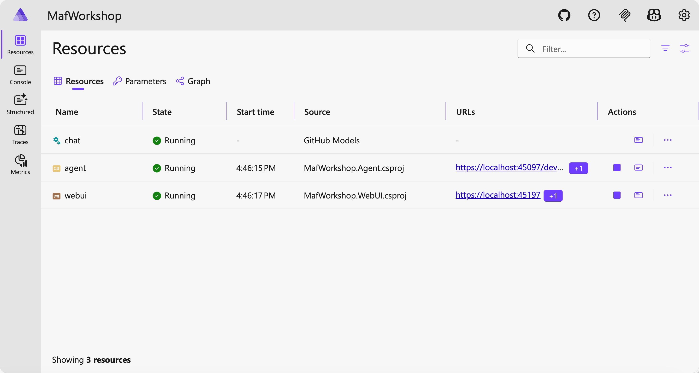
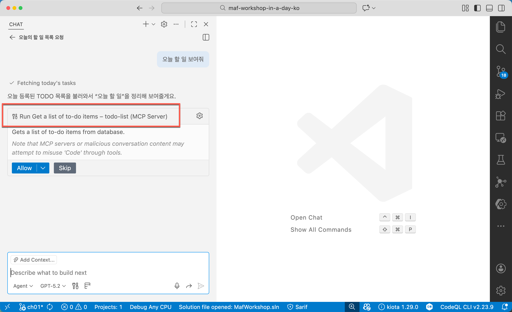
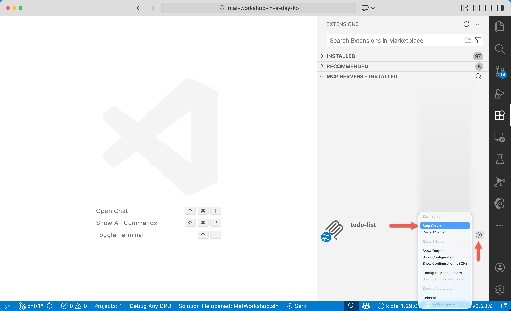
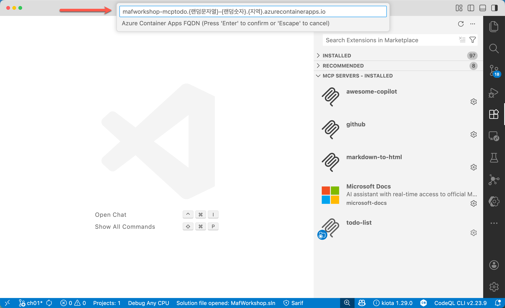

# 05: MCP 서버 개발하기

이 세션에서는 백엔드 에이전트에 통합할 [Model Context Protocal(MCP) 서버](https://modelcontextprotocol.io)를 개발합니다.

## 세션 목표

- MCP 서버를 개발할 수 있습니다.
- 로컬 HTTP 환경에서 MCP 서버를 작동시킬 수 있습니다.
- MCP 서버를 Azure 클라우드로 배포할 수 있습니다.
- 리모트 HTTP 환경에서 MCP 서버를 작동시킬 수 있습니다.
- GitHub Copilot에 로컬 혹은 리모트 MCP 서버를 연결시킬 수 있습니다.

## 아키텍처

이 세션이 끝나고 나면 아래와 같은 시스템이 만들어집니다.


## 사전 준비 사항

이전 [00: 개발 환경 설정](./00-setup.md)에서 개발 환경을 모두 설정한 상태라고 가정합니다.

## 리포지토리 루트 설정

1. 아래 명령어를 실행시켜 `$REPOSITORY_ROOT` 환경 변수를 설정합니다.

    ```bash
    # zsh/bash
    REPOSITORY_ROOT=$(git rev-parse --show-toplevel)
    ```

    ```powershell
    # PowerShell
    $REPOSITORY_ROOT = git rev-parse --show-toplevel
    ```

## 시작 프로젝트 복사

이 워크샵을 위해 필요한 시작 프로젝트를 준비해 뒀습니다. 시작 프로젝트의 프로젝트 구조는 아래와 같습니다.

```text
save-points/
└── step-05/
    └── start/
        ├── .vscode/
        │   ├── mcp.http.local.json
        │   └── mcp.http.remote.json
        ├── infra/
        │   └── < bicep files >
        ├── MafWorkshop.sln
        └── MafWorkshop.McpTodo/
            ├── Properties/
            │   └── launchSettings.json
            ├── TodoDbContext.cs
            ├── Program.cs
            ├── appsettings.json
            └── MafWorkshop.McpTodo.csproj
```

> 프로젝트 소개:
>
> - `.vscode`: MCP 서버 실행용 설정 파일 디렉토리
> - `infra`: Azure 클라우드 리소스 배포용 bicep 파일 디렉토리
> - `MafWorkshop.McpTodo`: To-do 리스트 관리용 MCP 서버 프로젝트

1. 앞서 실습한 `workshop` 디렉토리가 있다면 삭제하거나 다른 이름으로 바꿔주세요. 예) `workshop-step-04`
1. 터미널을 열고 아래 명령어를 차례로 실행시켜 실습 디렉토리를 만들고 시작 프로젝트를 복사합니다.

    ```bash
    # zsh/bash
    rm -rf $REPOSITORY_ROOT/workshop && \
        mkdir -p $REPOSITORY_ROOT/workshop && \
        cp -a $REPOSITORY_ROOT/save-points/step-05/start/. $REPOSITORY_ROOT/workshop/
    ```

    ```powershell
    # PowerShell
    Remove-Item -Path $REPOSITORY_ROOT/workshop -Recurse -Force && `
        New-Item -Type Directory -Path $REPOSITORY_ROOT/workshop -Force && `
        Copy-Item -Path $REPOSITORY_ROOT/save-points/step-05/start/* -Destination $REPOSITORY_ROOT/workshop -Recurse -Force
    ```

## 시작 프로젝트 빌드 및 실행

1. 워크샵 디렉토리에 있는지 다시 한 번 확인합니다.

    ```bash
    cd $REPOSITORY_ROOT/workshop
    ```

1. 전체 프로젝트를 빌드합니다.

    ```bash
    dotnet restore && dotnet build
    ```

## HTTP 방식 MCP 서버 설정하기

1. 워크샵 디렉토리에 있는지 다시 한 번 확인합니다.

    ```bash
    cd $REPOSITORY_ROOT/workshop
    ```

1. `./MafWorkshop.McpTodo/Program.cs` 파일을 열고 `// MCP 서버 추가하기` 주석을 찾아 아래 내용을 추가합니다. MCP 서비스를 HTTP 형식의 의존성 개체로 등록합니다.

    ```csharp
    // MCP 서버 추가하기
    builder.Services.AddMcpServer()
                    .WithHttpTransport(o => o.Stateless = true)
                    .WithToolsFromAssembly(Assembly.GetEntryAssembly());
    ```

1. 같은 파일에서 `// MCP 엔드포인트 미들웨어 추가하기` 주석을 찾아 아래와 같이 입력합니다. MCP 서버의 엔드포인트를 등록합니다.

    ```csharp
    // MCP 엔드포인트 미들웨어 추가하기
    app.MapMcp("/mcp");
    ```

## MCP 서버에 Tool 추가하기

1. 워크샵 디렉토리에 있는지 다시 한 번 확인합니다.

    ```bash
    cd $REPOSITORY_ROOT/workshop
    ```

1. `./MafWorkshop.McpTodo/Program.cs` 파일을 열고 `// Todo Tool 추가하기` 주석을 찾아 아래 내용을 추가합니다. LLM이 이 MCP 서버를 통해 활용할 수 있는 도구를 작성합니다.

    ```csharp
    // Todo Tool 추가하기
    [McpServerToolType]
    public class TodoTool(ITodoRepository todo, ILogger<TodoTool> logger)
    {
        [McpServerTool(Name = "add_todo_item", Title = "Add a to-do item")]
        [Description("Adds a to-do item to database.")]
        public async Task<string> AddTodoItemAsync(
            [Description("The to-do item text")] string todoItemText
        )
        {
            var todoItem = new TodoItem { Text = todoItemText };
            await todo.AddTodoItemAsync(todoItem).ConfigureAwait(false);
    
            logger.LogInformation("Todo item added: '{todoItemText}' (ID: {Id})", todoItemText, todoItem.Id);
    
            return $"Todo item added: '{todoItemText}' (ID: {todoItem.Id})";
        }
    
        [McpServerTool(Name = "get_todo_items", Title = "Get a list of to-do items")]
        [Description("Gets a list of to-do items from database.")]
        public async Task<IEnumerable<string>> GetTodoItemsAsync()
        {
            var todoItems = await todo.GetAllTodoItemsAsync().ConfigureAwait(false);
    
            logger.LogInformation("Retrieved {Count} todo items.", todoItems.Count());
    
            return todoItems.Any()
                   ? todoItems.Select(p => $"ID: {p.Id}, Text: {p.Text}, Completed: {p.IsCompleted}")
                   : [ "No todo items found." ];
        }
    
        [McpServerTool(Name = "update_todo_item", Title = "Update a to-do item")]
        [Description("Updates a to-do item in the database.")]
        public async Task<string> UpdateTodoItemAsync(
            [Description("The to-do item ID")] int id,
            [Description("The to-do item text")] string todoItemText
        )
        {
            var todoItem = new TodoItem { Id = id, Text = todoItemText };
            var updated = await todo.UpdateTodoItemAsync(todoItem).ConfigureAwait(false);
            if (updated is null)
            {
                logger.LogWarning("Todo item with ID '{id}' not found.", id);
    
                return $"Todo item with ID '{id}' not found.";
            }
    
            logger.LogInformation("Updated todo item: '{id}' with text: '{todoItem}'", id, todoItem);
    
            return $"Todo item updated: '{id}' with text: '{todoItem}'";
        }
    
        [McpServerTool(Name = "complete_todo_item", Title = "Complete a to-do item")]
        [Description("Completes a to-do item in the database.")]
        public async Task<string> CompleteTodoItemAsync(
            [Description("The to-do item ID")] int id
        )
        {
            var todoItem = new TodoItem() { Id = id, IsCompleted = true };
            var completed = await todo.CompleteTodoItemAsync(todoItem).ConfigureAwait(false);
            if (completed is null)
            {
                logger.LogWarning("Todo item with ID '{id}' not found.", id);
    
                return $"Todo item with ID '{id}' not found.";
            }
    
            logger.LogInformation("Completed todo item: '{id}'", id);
    
            return $"Todo item completed: '{id}'";
        }
    
        [McpServerTool(Name = "delete_todo_item", Title = "Delete a to-do item")]
        [Description("Deletes a to-do item from the database.")]
        public async Task<string> DeleteTodoItemAsync(
            [Description("The to-do item ID")] int id
        )
        {
            var deleted = await todo.DeleteTodoItemAsync(id).ConfigureAwait(false);
            if (deleted is null)
            {
                logger.LogWarning("Todo item with ID '{id}' not found.", id);
    
                return $"Todo item with ID '{id}' not found.";
            }
    
            logger.LogInformation("Deleted todo item: '{id}'", id);
    
            return $"Todo item deleted: '{id}'";
        }
    }
    ```

## 로컬 MCP 서버에서 GitHub Copilot에 연결하기

1. 워크샵 디렉토리에 있는지 다시 한 번 확인합니다.

    ```bash
    cd $REPOSITORY_ROOT/workshop
    ```

1. 아래 명령어를 실행시켜 `.vscode/mcp.json` 파일을 생성합니다.

    ```bash
    # zsh/bash
    mkdir -p $REPOSITORY_ROOT/.vscode
    cp ./.vscode/mcp.http.local.json $REPOSITORY_ROOT/.vscode/mcp.json 
    ```

    ```powershell
    # PowerShell
    New-Item -Type Directory -Path $REPOSITORY_ROOT/.vscode -Force
    Copy-Item -Path ./.vscode/mcp.http.local.json -Destination $REPOSITORY_ROOT/.vscode/mcp.json -Force
    ```

1. MCP 서버 애플리케이션을 실행합니다.

    ```bash
    dotnet run --project ./MafWorkshop.McpTodo
    ```

1. 오른쪽 익스텐션 아이콘을 클릭한 후 MCP 서버 섹션을 보면 `todo-list` MCP 서버가 보입니다. 톱니바퀴 모양을 클릭한 후 `Start Server` 메뉴를 클릭해서 MCP 서버를 실행시킵니다.

   

1. GitHub Copilot 창을 열어 아래와 같이 `todo-list` MCP 서버를 선택했는지 확인합니다.

   

1. GitHub Copilot 창에서 아래와 비슷한 프롬프트를 전송합니다.

    ```text
    - 오늘 할 일 보여줘
    - 오후 2시 미팅 추가해줘
    ```

   

1. GitHub Copilot이 `todo-list` MCP 서버를 잘 실행시켜 원하는 작업을 수행했는지 확인합니다.

   

1. 오른쪽 익스텐션 아이콘을 클릭한 후 MCP 서버 섹션을 보면 `todo-list` MCP 서버가 보입니다. 톱니바퀴 모양을 클릭한 후 `Stop Server` 메뉴를 클릭해서 MCP 서버를 종료합니다.

   

1. 터미널에서 `CTRL`+`C` 키를 눌러 애플리케이션 실행을 종료합니다.

## 리모트 MCP 서버에서 GitHub Copilot에 연결하기

> **NOTE**: Azure 구독을 제공 받았을 경우 진행하세요. 워크샵에 따라 Azure 구독을 제공하지 않을 수도 있습니다.

1. 워크샵 디렉토리에 있는지 다시 한 번 확인합니다.

    ```bash
    cd $REPOSITORY_ROOT/workshop
    ```

1. 아래 명령어를 실행시켜 MCP 서버를 배포하세요.

    ```bash
    azd up
    ```

   아래와 같은 질문이 나오면 적당하게 입력합니다.

   - `? Enter a unique environment name:` 👉 환경 이름 (예: `mafworkshop-2026`)
   - `? Enter a value for the 'location' infrastructure parameter:` 👉 지역 선택 (예: `Korea Central`)

   잠시 기다리면 MCP 서버를 배포한 Azure Container Apps 인스턴스가 만들어진 것을 확인할 수 있습니다.

1. 아래 명령어를 실행시켜 Azure Container Apps 인스턴스의 URL 값을 확인합니다. URL의 형식은 `mafworkshop-mcptodo.{랜덤문자열}-{랜덤숫자}.{지역}.azurecontainerapps.io`입니다.

    ```bash
    azd env get-value AZURE_RESOURCE_MAFWORKSHOP_MCPTODO_FQDN
    ```

1. 아래 명령어를 실행시켜 `.vscode/mcp.json` 파일을 생성합니다.

    ```bash
    # zsh/bash
    mkdir -p $REPOSITORY_ROOT/.vscode
    cp ./.vscode/mcp.http.remote.json $REPOSITORY_ROOT/.vscode/mcp.json 
    ```

    ```powershell
    # PowerShell
    New-Item -Type Directory -Path $REPOSITORY_ROOT/.vscode -Force
    Copy-Item -Path ./.vscode/mcp.http.remote.json -Destination $REPOSITORY_ROOT/.vscode/mcp.json -Force
    ```

1. 오른쪽 익스텐션 아이콘을 클릭한 후 MCP 서버 섹션을 보면 `todo-list` MCP 서버가 보입니다. 톱니바퀴 모양을 클릭한 후 `Start Server` 메뉴를 클릭해서 MCP 서버를 실행시킵니다.

   

   서버를 실행시키는 과정에서 아래와 같이 리모트 서버의 주소를 물어봅니다. 이 때 앞서 확인했던 리모트 MCP 서버의 주소를 입력하세요.

   

1. GitHub Copilot 창을 열어 아래와 같이 `todo-list` MCP 서버를 선택했는지 확인합니다.

   

1. GitHub Copilot 창에서 아래와 비슷한 프롬프트를 전송합니다.

    ```text
    - 오늘 할 일 보여줘
    - 오후 2시 미팅 추가해줘
    ```

   

1. GitHub Copilot이 `todo-list` MCP 서버를 잘 실행시켜 원하는 작업을 수행했는지 확인합니다.

   

1. 오른쪽 익스텐션 아이콘을 클릭한 후 MCP 서버 섹션을 보면 `todo-list` MCP 서버가 보입니다. 톱니바퀴 모양을 클릭한 후 `Stop Server` 메뉴를 클릭해서 MCP 서버를 종료합니다.

   

1. 아래 명령어를 실행시켜 방금 배포한 애플리케이션을 모두 삭제합니다.

    ```bash
    azd down --purge --force

## 완성본 결과 확인

이 세션의 완성본은 `$REPOSITORY_ROOT/save-points/step-05/complete`에서 확인할 수 있습니다.

1. 앞서 실습한 `workshop` 디렉토리가 있다면 삭제하거나 다른 이름으로 바꿔주세요. 예) `workshop-step-05`
1. 터미널을 열고 아래 명령어를 차례로 실행시켜 실습 디렉토리를 만들고 시작 프로젝트를 복사합니다.

    ```bash
    # zsh/bash
    rm -rf $REPOSITORY_ROOT/workshop && \
        mkdir -p $REPOSITORY_ROOT/workshop && \
        cp -a $REPOSITORY_ROOT/save-points/step-05/complete/. $REPOSITORY_ROOT/workshop/
    ```

    ```powershell
    # PowerShell
    Remove-Item -Path $REPOSITORY_ROOT/workshop -Recurse -Force && `
        New-Item -Type Directory -Path $REPOSITORY_ROOT/workshop -Force && `
        Copy-Item -Path $REPOSITORY_ROOT/save-points/step-05/complete/* -Destination $REPOSITORY_ROOT/workshop -Recurse -Force
    ```

1. 워크샵 디렉토리로 이동합니다.

    ```bash
    cd $REPOSITORY_ROOT/workshop
    ```

1. [로컬 MCP 서버에서 GitHub Copilot에 연결하기](#로컬-mcp-서버에서-github-copilot에-연결하기) 섹션을 따라합니다.
1. [리모트 MCP 서버에서 GitHub Copilot에 연결하기](#리모트-mcp-서버에서-github-copilot에-연결하기) 섹션을 따라합니다.

---

축하합니다! 에이전트에 사용하기 위한 MCP 서버를 직접 개발했습니다. 이제 다음 단계로 이동하세요!

👈 [04: Aspire로 프론트엔드 웹 UI와 백엔드 에이전트 오케스트레이션하기](./04-aspire-orchestration.md) | [06: Microsoft Agent Framework에 MCP 서버 연동하기](./06-mcp-server-integration-with-maf.md) 👉
