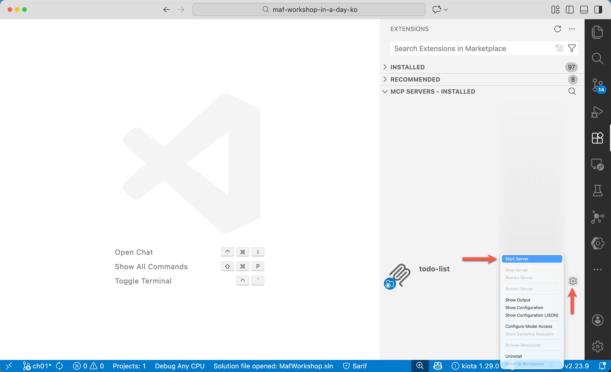
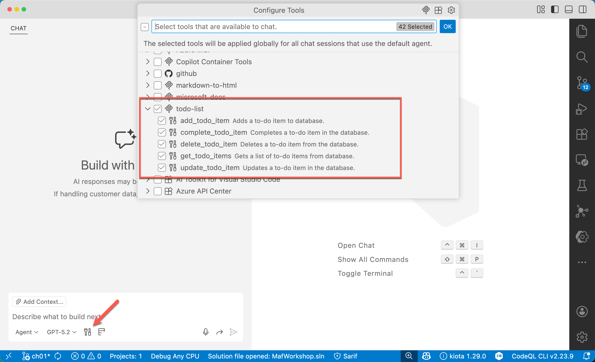
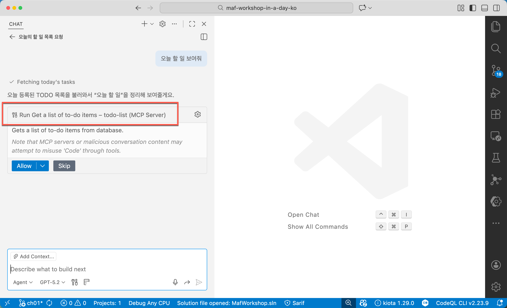
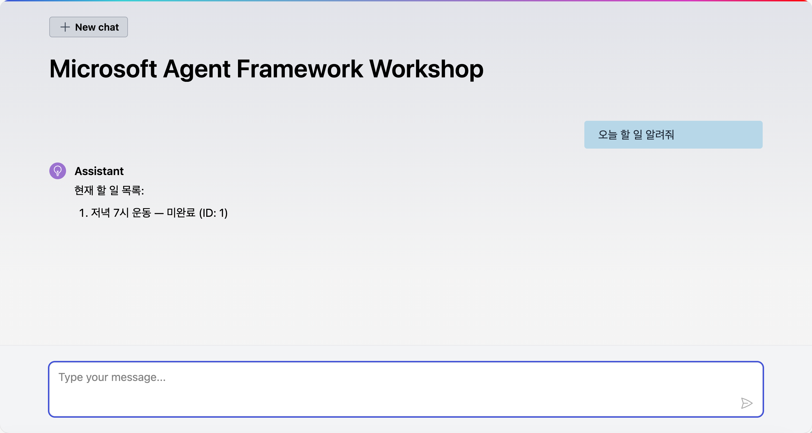
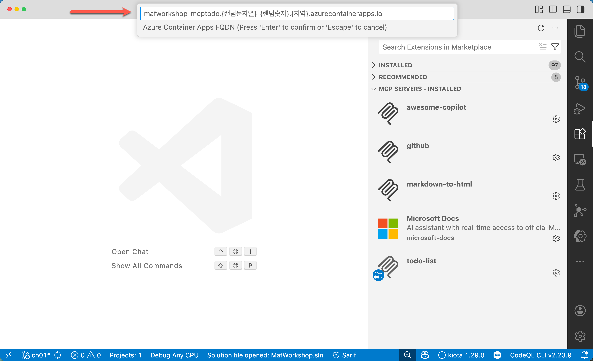

# 05: Microsoft Agent Framework에 MCP 서버 연동하기

이 세션에서는 [앞서 만들었던](./04-mcp-server-development.md) MCP 서버를 Microsoft Agent Framework에 연동합니다.

## 세션 목표

- MCP 서버를 Microsoft Agent Framework에 연동시킬 수 있습니다.

## 사전 준비 사항

- 이전 [00: 개발 환경 설정](./00-setup.md)에서 개발 환경을 모두 설정한 상태라고 가정합니다.
- 이전 [04: MCP 서버 개발하기](./04-mcp-server-development.md)에서 MCP 서버 개발을 완성한 상태라고 가정합니다.

## 리포지토리 루트 설정

1. 아래 명령어를 실행시켜 `$REPOSITORY_ROOT` 환경 변수를 설정합니다.

    ```bash
    # zsh/bash
    REPOSITORY_ROOT=$(git rev-parse --show-toplevel)
    ```

    ```powershell
    # PowerShell
    $REPOSITORY_ROOT = git rev-parse --show-toplevel
    ```

## 시작 프로젝트 복사

이 워크샵을 위해 필요한 시작 프로젝트를 준비해 뒀습니다. 시작 프로젝트의 프로젝트 구조는 아래와 같습니다.

```text
save-points/
└── step-03/
    └── start/
        ├── .vscode/
        │   ├── mcp.http.local.json
        │   └── mcp.http.remote.json
        ├── MafWorkshop.sln
        ├── MafWorkshop.Agent/
        │   ├── Properties/
        │   │   └── launchSettings.json
        │   ├── Program.cs
        │   ├── appsettings.json
        │   └── MafWorkshop.Agent.csproj
        ├── MafWorkshop.McpTodo/
        │   ├── Properties/
        │   │   └── launchSettings.json
        │   ├── TodoDbContext.cs
        │   ├── Program.cs
        │   ├── appsettings.json
        │   └── MafWorkshop.McpTodo.csproj
        ├── MafWorkshop.WebUI/
        │   ├── Properties/
        │   │   └── launchSettings.json
        │   ├── Components/
        │   │   └── < Razor component files >
        │   ├── wwwroot/
        │   │   └── < HTML/CSS/JS files >
        │   ├── Program.cs
        │   ├── appsettings.json
        │   └── MafWorkshop.WebUI.csproj
        ├── MafWorkshop.AppHost/
        │   ├── Properties/
        │   │   └── launchSettings.json
        │   ├── Program.cs
        │   ├── appsettings.json
        │   └── MafWorkshop.AppHost.csproj
        └── MafWorkshop.ServiceDefaults/
            ├── Extension.cs
            └── MafWorkshop.ServiceDefaults.csproj
```

> 프로젝트 소개:
>
> - `MafWorkshop.Agent`: 백엔드 에이전트 애플리케이션 프로젝트
> - `MafWorkshop.McpTodo`: To-do 리스트 관리용 MCP 서버 프로젝트
> - `MafWorkshop.WebUI`: 프론트엔드 웹 UI 애플리케이션 프로젝트
> - `MafWorkshop.AppHost`: Aspire 오케스트레이션 프로젝트
> - `MafWorkshop.ServiceDefaults`: Aspire Observability 및 Traceability 확장 프로젝트

1. 앞서 실습한 `workshop` 디렉토리가 있다면 삭제하거나 다른 이름으로 바꿔주세요. 예) `workshop-step-04`
1. 터미널을 열고 아래 명령어를 차례로 실행시켜 실습 디렉토리를 만들고 시작 프로젝트를 복사합니다.

    ```bash
    # zsh/bash
    rm -rf $REPOSITORY_ROOT/workshop && \
        mkdir -p $REPOSITORY_ROOT/workshop && \
        cp -a $REPOSITORY_ROOT/save-points/step-05/start/. $REPOSITORY_ROOT/workshop/
    ```

    ```powershell
    # PowerShell
    Remove-Item -Path $REPOSITORY_ROOT/workshop -Recurse -Force && `
        New-Item -Type Directory -Path $REPOSITORY_ROOT/workshop -Force && `
        Copy-Item -Path $REPOSITORY_ROOT/save-points/step-05/start/* -Destination $REPOSITORY_ROOT/workshop -Recurse -Force
    ```

## 시작 프로젝트 빌드 및 실행

1. 워크샵 디렉토리에 있는지 다시 한 번 확인합니다.

    ```bash
    cd $REPOSITORY_ROOT/workshop
    ```

1. 전체 프로젝트를 빌드합니다.

    ```bash
    dotnet restore && dotnet build
    ```

1. Aspire 오케스트레이션 애플리케이션을 실행합니다.

    ```bash
    dotnet watch run --project ./MafWorkshop.AppHost
    ```

1. 자동으로 웹 브라우저가 열리면서 아래와 같은 Aspire 대시보드 페이지가 나타나는지 확인합니다.

   

1. 터미널에서 `CTRL`+`C` 키를 눌러 애플리케이션 실행을 종료합니다.

## Aspire 오케스트레이션 구성 - 호스트

1. 워크샵 디렉토리에 있는지 다시 한 번 확인합니다.

    ```bash
    cd $REPOSITORY_ROOT/workshop
    ```

1. 아래 명령어를 실행시켜 오케스트레이션을 위한 백엔드 및 프론트엔드 애플리케이션을 추가합니다.

    ```bash
    dotnet add ./MafWorkshop.AppHost reference ./MafWorkshop.McpTodo
    ```

1. `./MafWorkshop.AppHost/AppHost.cs` 파일을 열고 `// MCP Todo 서버 프로젝트 추가하기` 주석을 찾아 아래 내용을 추가합니다.

    ```csharp
    // MCP Todo 서버 프로젝트 추가하기
    var mcptodo = builder.AddProject<Projects.MafWorkshop_McpTodo>("mcptodo")
                         .WithExternalHttpEndpoints();
    ```

1. 같은 파일에서 `// 백엔드 에이전트 프로젝트 수정하기` 주석을 찾아 아래와 같이 변경합니다.

   **변경전:**

    ```csharp
    // 백엔드 에이전트 프로젝트 수정하기
    var agent = builder.AddProject<Projects.MafWorkshop_Agent>("agent")
                       .WithExternalHttpEndpoints()
                       .WithLlmReference(builder.Configuration);
    ```

   **변경후:**

    ```csharp
    // 백엔드 에이전트 프로젝트 수정하기
    var agent = builder.AddProject<Projects.MafWorkshop_Agent>("agent")
                       .WithExternalHttpEndpoints()
                       .WithLlmReference(builder.Configuration)
                       .WithReference(mcptodo)
                       .WaitFor(mcptodo);
    ```

## Aspire 오케스트레이션 구성 - 백엔드 에이전트

1. 워크샵 디렉토리에 있는지 다시 한 번 확인합니다.

    ```bash
    cd $REPOSITORY_ROOT/workshop
    ```

1. `./MafWorkshop.Agent/Program.cs` 파일을 열고 `// HttpClientFactory 등록하기` 주석을 찾아 아래 내용을 추가합니다.

    ```csharp
    // HttpClientFactory 등록하기
    builder.Services.AddHttpClient("mcptodo", client =>
    {
        client.BaseAddress = new Uri("https+http://mcptodo");
    });
    ```

1. 같은 파일에서 `// MCP 클라이언트 등록하기` 주석을 찾아 아래와 같이 입력합니다.

    ```csharp
    // MCP 클라이언트 등록하기
    builder.Services.AddSingleton<McpClient>(sp =>
    {
        var loggerFactory = sp.GetRequiredService<ILoggerFactory>();
        var httpClient = sp.GetRequiredService<IHttpClientFactory>()
                           .CreateClient("mcptodo");
    
        var clientTransportOptions = new HttpClientTransportOptions()
        {
            Endpoint = new Uri($"{httpClient.BaseAddress!.ToString().Replace("+http", string.Empty).TrimEnd('/')}/mcp")
        };
        var clientTransport = new HttpClientTransport(clientTransportOptions, httpClient, loggerFactory);
    
        var clientOptions = new McpClientOptions()
        {
            ClientInfo = new Implementation()
            {
                Name = "MCP Todo Client",
                Version = "1.0.0",
            }
        };
    
        return McpClient.CreateAsync(clientTransport, clientOptions, loggerFactory).GetAwaiter().GetResult();
    });
    ```

1. 같은 파일에서 `// Manager 에이전트 추가하기` 주석을 찾아 아래와 같이 입력합니다.

    ```csharp
    // Manager 에이전트 추가하기
    builder.AddAIAgent(
        name: "manager",
        createAgentDelegate: (sp, key) =>
        {
            var chatClient = sp.GetRequiredService<IChatClient>();
            var mcpClient = sp.GetRequiredService<McpClient>();
            var tools = mcpClient.ListToolsAsync().GetAwaiter().GetResult();
            var agent = new ChatClientAgent(
                chatClient: chatClient,
                name: key,
                instructions: """
                    You manage my todo list items.
                    When I ask for the list, provide all the items in a numbered format with their complete status.
                    When I give you a new todo item, add it to the list.
                    When I give you an updated todo item, update it in the list.
                    When I ask you to mark an item as done, mark it as completed.
                    When I ask you to remove an item, delete it from the list.
                    When I ask you to clear the list, remove all items.
                    """,
                tools: [.. tools]
            );
    
            return agent;
        }
    );
    ```

1. 같은 파일에서 `// AG-UI 미들웨어 설정하기` 주석을 찾아 아래와 같이 입력합니다.

    ```csharp
    // AG-UI 미들웨어 설정하기
    app.MapAGUI(
        pattern: "ag-ui",
        aiAgent: app.Services.GetRequiredKeyedService<AIAgent>("manager")
    );
    ```

## 애플리케이션 빌드 및 실행

1. 워크샵 디렉토리에 있는지 다시 한 번 확인합니다.

    ```bash
    cd $REPOSITORY_ROOT/workshop
    ```

1. 전체 프로젝트를 빌드합니다.

    ```bash
    dotnet restore && dotnet build
    ```

1. Aspire 오케스트레이션 애플리케이션을 실행합니다.

    ```bash
    dotnet watch run --project ./MafWorkshop.AppHost
    ```

1. 자동으로 웹 브라우저가 열리면서 아래와 같은 Aspire 대시보드 페이지가 나타나는지 확인합니다.

   

1. 백엔드 에이전트 앱 링크를 클릭해서 Dev UI 화면이 잘 보이는지 확인합니다. 그리고, Manager 에이전트를 선택해서 잘 동작하는지 확인합니다.

   

1. 프론트엔드 웹 UI 앱 링크를 클릭해서 챗 UI 화면이 잘 보이는지 확인합니다. 그리고, 메시지를 입력해서 결과를 잘 출력하는지 확인합니다.

   

1. 터미널에서 `CTRL`+`C` 키를 눌러 애플리케이션 실행을 종료합니다.

## 애플리케이션 배포 및 실행

> **NOTE**: Azure 구독을 제공 받았을 경우 진행하세요. 워크샵에 따라 Azure 구독을 제공하지 않을 수도 있습니다.

1. 워크샵 디렉토리에 있는지 다시 한 번 확인합니다.

    ```bash
    cd $REPOSITORY_ROOT/workshop
    ```

1. 아래 명령어를 실행시켜 MCP 서버를 배포하세요.

    ```bash
    azd up
    ```

   아래와 같은 질문이 나오면 적당하게 입력합니다.

   - `? Enter a unique environment name:` 👉 환경 이름 (예: mafworkshop-2026)
   - `? Enter a value for the 'aiLlmProvider' infrastructure parameter:` 👉 LLM 제공자 선택 - `AzureOpenAI` 또는 `GitHubModels` 선택
   - `? Enter a value for the 'apiKey' infrastructure secured parameter:` 👉 API 키 값 입력
   - `? Enter a value for the 'endpoint' infrastructure parameter:` 👉 LLM 엔드포인트 입력 - GitHub Models 선택할 경우 건너뛰기 기능
   - `? Enter a value for the 'location' infrastructure parameter:` 👉 지역 선택 (예: Korea Central)

   잠시 기다리면 프론트엔드 웹 UI, 백엔드 에이전트 및 MCP 서버를 배포한 Azure Container Apps 인스턴스가 각각 만들어진 것을 확인할 수 있습니다.

   

1. 위 스크린샷의 `webui` 링크를 클릭해서 웹 UI 화면이 나오면 아래와 비슷하게 프롬프트를 입력한 후 결과를 확인합니다.

    ```text
    - 오늘 할 일 보여줘
    - 오후 2시 미팅 추가해줘
    ```

   

## 완성본 결과 확인

이 세션의 완성본은 `$REPOSITORY_ROOT/save-points/step-05/complete`에서 확인할 수 있습니다.

1. 앞서 실습한 `workshop` 디렉토리가 있다면 삭제하거나 다른 이름으로 바꿔주세요. 예) `workshop-step-05`
1. 터미널을 열고 아래 명령어를 차례로 실행시켜 실습 디렉토리를 만들고 시작 프로젝트를 복사합니다.

    ```bash
    # zsh/bash
    mkdir -p $REPOSITORY_ROOT/workshop && \
        cp -a $REPOSITORY_ROOT/save-points/step-05/complete/. $REPOSITORY_ROOT/workshop/
    ```

    ```powershell
    # PowerShell
    New-Item -Type Directory -Path $REPOSITORY_ROOT/workshop -Force && `
        Copy-Item -Path $REPOSITORY_ROOT/save-points/step-05/complete/* -Destination $REPOSITORY_ROOT/workshop -Recurse -Force
    ```

1. 워크샵 디렉토리로 이동합니다.

    ```bash
    cd $REPOSITORY_ROOT/workshop
    ```

1. [애플리케이션 빌드 및 실행](#애플리케이션-빌드-및-실행) 섹션을 따라합니다.
1. [애플리케이션 배포 및 실행](#애플리케이션-배포-및-실행) 섹션을 따라합니다.

---

축하합니다! 백엔드 에이전트에 MCP 서버를 직접 연동해 봤습니다. 이제 다음 단계로 이동하세요!

👈 [04: MCP 서버 개발하기](./04-mcp-server-development.md) | [06: Copilot Studio에서 에이전트 개발하고 MCP 서버 연동하기](./06-mcp-server-integration-with-copilot-studio.md) 👉
